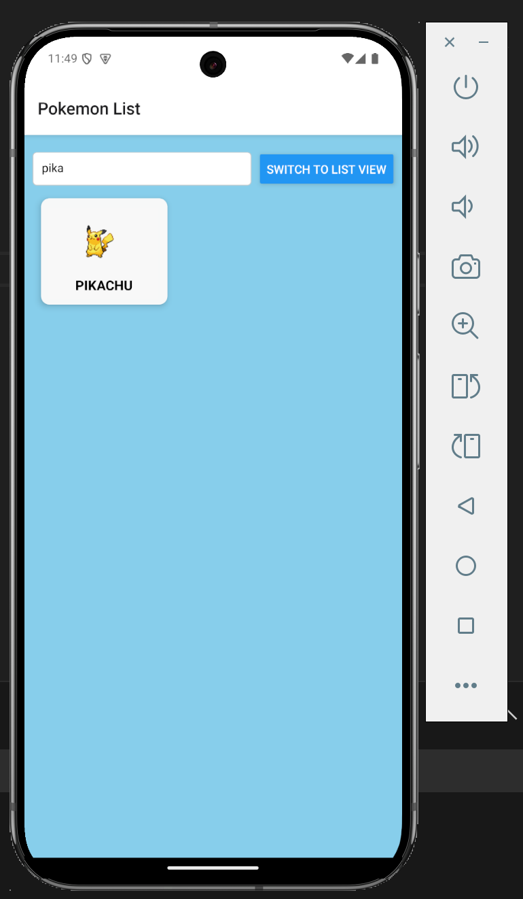

# React Native APP (POKEMON APP)

# Project File Structure
```
.
├── App.js
├── README.md
├── app.json
├── assets
│   ├── adaptive-icon.png
│   ├── details.png
│   ├── favicon.png
│   ├── grid.png
│   ├── icon.png
│   ├── list.png
│   ├── nopokemonlist.png
│   ├── pokeball.png
│   ├── search.png
│   └── splash-icon.png
├── index.js
├── package-lock.json
├── package.json
└── src
    ├── components
    │   ├── ErrorBoundary.js
    │   ├── PokemonCard.js
    │   ├── StatsList.js
    │   └── TypeBadge.js
    ├── config.js
    ├── navigation
    │   └── AppNavigator.js
    ├── screens
    │   ├── DetailScreen.js
    │   └── HomeScreen.js
    ├── services
    │   ├── api.js
    │   └── apiClient.js
    └── styles
        ├── DetailScreenStyles.js
        └── HomeScreenStyles.js
```


# APP Picture Demo
Below are the various screenshots on the app

<table>
  <tr>
    <th>No pokemon</th>
    <th>Grid view</th>
    <th>Listview</th>
    <th>Search</th>
    <th>details</th>
  </tr>
  <tr>
    <td></td>
    <td></td>
    <td></td>
    <td></td>
    <td></td>
 </tr>
</table>


pre-requisites
emulator/android phone/iphone

TODO:

add evolve button

add test

toggle list and grid with image

## Instructions to download and run
```
$ npm install -g expo-cli //install expo cli global

$ git clone https://github.com/FreddyTaelo/pokemon-app.git // get project from github

$ cd pokemon-app

$ npm install // install dependencies

$ npm expo start // start up


// make sure to have an emulator running or use your mobile phone to scan the QR code on the terminal, this will start the app for you.
follow the prompts on the terminal
...
````